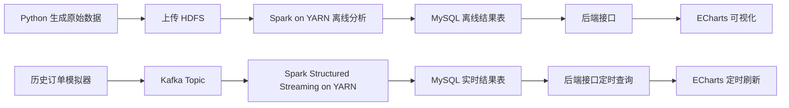

# Spark 电商数据分析项目实施流程方针

## 1. 项目边界

本项目只实现“大数据分析到 MySQL 入库”这一段，不负责最终 Web 可视化系统开发。

当前阶段的最终交付目标是：

1. 使用 IDEA 创建 Maven + Scala 项目。
2. 在本机完成代码编写和打包。
3. 将打包后的 JAR 上传到三台虚拟机集群中的 master 节点执行。
4. 使用 Spark on YARN 完成离线分析和实时分析。
5. 将所有分析结果写入虚拟机中的 MySQL。
6. 最后可通过 `mysqldump` 导出 MySQL 数据表，交给 Web 项目使用。

PPT、可行性报告、数据字典、测试报告等文档，等项目流程跑通后再补。

## 2. 虚拟机和集群约束

集群使用现有三台虚拟机：

| 角色 | 虚拟机名称 | 说明 |
|---|---|---|
| master | CentOS 8 | 运行 HDFS NameNode、YARN ResourceManager、Spark 提交节点、Kafka、MySQL |
| slave1 | spark-slave1 | 运行 HDFS DataNode、YARN NodeManager、Spark executor |
| slave2 | spark-slave2 | 运行 HDFS DataNode、YARN NodeManager、Spark executor |

必须注意：

- 不再提高虚拟机内存，因为当前 C 盘空间紧张，且虚拟机资源有限。
- Spark 任务必须按低内存方式提交，不能使用过大的 executor 内存和过多并行度。
- 项目数据集不能追求“越大越好”，应控制在能稳定跑完的规模。
- 老师要求可以满足“15000+ 条数据”，所以采用 Python 生成数据集，比硬找外部数据集更可控。

建议 Spark 提交资源参数：

```bash
spark-submit \
  --class com.niit.spark.ecommerce.OfflineJob \
  --master yarn \
  --deploy-mode client \
  --num-executors 2 \
  --executor-cores 1 \
  --executor-memory 512m \
  --driver-memory 512m \
  --conf spark.sql.shuffle.partitions=6 \
  ecommerce-analysis-1.0-SNAPSHOT.jar
```

实时任务也使用同级别的小资源配置，避免 Kafka、Spark Streaming、MySQL 同时运行时把 master 压死。

## 3. 总体技术路线

项目分为两条链路：离线分析链路和实时分析链路。



本项目只做到图中的 MySQL 离线结果表和 MySQL 实时结果表。后端接口和 ECharts 页面由其他人完成。

## 4. 数据集方案

不再从阿里云或天池寻找外部数据集，改为使用 Python 脚本生成中文电商交易数据。

原因：

1. 外部数据集字段经常不适合项目分析，需要大量清洗。
2. 生成数据可以保证字段完整，方便做离线和实时两类分析。
3. 可以人为加入业务规律，避免分析结果看起来像随机数。
4. 数据规模可控，适合当前三台低内存虚拟机。

建议生成 4 个 CSV 文件：

| 文件 | 说明 | 建议规模 |
|---|---|---|
| users.csv | 用户信息表 | 10000+ 行 |
| products.csv | 商品信息表 | 500+ 行 |
| orders.csv | 订单主表 | 50000+ 行 |
| order_items.csv | 订单明细表 | 120000+ 行 |

核心字段设计：

### users.csv

| 字段 | 说明 |
|---|---|
| user_id | 用户 ID |
| user_name | 用户昵称 |
| gender | 性别 |
| age | 年龄 |
| province | 省份 |
| city | 城市 |
| member_level | 会员等级 |
| register_date | 注册日期 |

### products.csv

| 字段 | 说明 |
|---|---|
| product_id | 商品 ID |
| product_name | 商品名称 |
| category | 一级品类 |
| brand | 品牌 |
| price | 商品单价 |
| cost | 商品成本 |

### orders.csv

| 字段 | 说明 |
|---|---|
| order_id | 订单 ID |
| user_id | 用户 ID |
| order_time | 下单时间 |
| pay_time | 支付时间 |
| province | 收货省份 |
| city | 收货城市 |
| channel | 下单渠道 |
| order_status | 订单状态 |
| total_amount | 订单总金额 |
| discount_amount | 优惠金额 |
| pay_amount | 实付金额 |

### order_items.csv

| 字段 | 说明 |
|---|---|
| item_id | 明细 ID |
| order_id | 订单 ID |
| product_id | 商品 ID |
| category | 商品品类 |
| quantity | 购买数量 |
| price | 单价 |
| amount | 明细金额 |

数据生成时必须加入业务规律：

- 晚上 20:00-22:00 订单量更高。
- 周末订单量略高。
- 会员等级越高，客单价越高。
- 服饰、美妆、数码、食品等品类销量有差异。
- 广东、江苏、浙江、山东、河南等省份消费量较高。
- 促销日期订单量和优惠金额更高。

这一步很关键：如果数据只是随机生成，最后图表没有解释力，答辩时很容易被问穿。

## 5. Maven + Scala 项目结构

IDEA 中使用 Maven 创建项目，不使用 SBT。

建议项目结构：

```text
ecommerce-analysis/
├── pom.xml
├── scripts/
│   ├── generate_ecommerce_data.py
│   ├── kafka_order_producer.py
│   └── mysql_init.sql
├── data/
│   └── sample/
├── src/
│   └── main/
│       ├── resources/
│       │   └── application.properties
│       └── scala/
│           └── com/
│               └── niit/
│                   └── spark/
│                       └── ecommerce/
│                           ├── OfflineJob.scala
│                           ├── StreamingJob.scala
│                           ├── common/
│                           ├── offline/
│                           └── realtime/
```

版本要求：

| 组件 | 建议版本 | 说明 |
|---|---|---|
| Scala | 2.12.x | 必须和 Spark 的 Scala 二进制版本一致 |
| Spark | 以虚拟机 `spark-submit --version` 为准 | 如果集群是 Spark 3.x，一般使用 `_2.12` 依赖 |
| Maven | IDEA 自带 Maven 即可 | 不要求系统 PATH 有 Maven |
| JDK | 1.8 | 与大多数 Spark 3.x 环境兼容 |
| MySQL JDBC | 8.x | 用于 Spark 写入 MySQL |
| Kafka Connector | `spark-sql-kafka-0-10_2.12` | 用于 Structured Streaming 读取 Kafka |

严禁混用 `_2.11` 和 `_2.12` 的 Spark 依赖，否则本地可能能编译，集群运行会报类冲突。

## 6. 离线分析设计

老师要求每人至少 4 个离线统计报表，并且分析类型不能重复。因此不能简单做 4 个 `groupBy count`。

建议实现以下 4 个离线分析：

| 编号 | 分析主题 | 分析类型 | MySQL 结果表 |
|---|---|---|---|
| A1 | 销售时间趋势分析 | 时间序列统计 | ads_sales_time_trend |
| A2 | 品类销售排行分析 | 多维聚合 + TopN | ads_category_sales_rank |
| A3 | 用户价值分层分析 | RFM 用户分层 | ads_user_value_level |
| A4 | 商品品类关联分析 | 购物篮关联规则 | ads_category_association_rules |

### A1 销售时间趋势分析

目标：

- 统计每天、每小时的订单数、销售额、支付金额、客单价。
- 用于展示销售趋势和高峰时间段。

输出字段示例：

| 字段 | 说明 |
|---|---|
| stat_date | 日期 |
| stat_hour | 小时 |
| order_count | 订单数 |
| user_count | 下单用户数 |
| total_amount | 销售额 |
| pay_amount | 实付金额 |
| avg_order_amount | 客单价 |

### A2 品类销售排行分析

目标：

- 统计不同品类的销量、销售额、订单数。
- 使用窗口函数实现 TopN。

输出字段示例：

| 字段 | 说明 |
|---|---|
| stat_date | 日期 |
| category | 品类 |
| order_count | 订单数 |
| quantity_sum | 销量 |
| amount_sum | 销售额 |
| category_rank | 排名 |

### A3 用户价值分层分析

目标：

- 使用 RFM 思路对用户分层。
- R 表示最近一次消费距离当前日期的天数。
- F 表示消费频次。
- M 表示消费金额。

输出字段示例：

| 字段 | 说明 |
|---|---|
| user_id | 用户 ID |
| province | 省份 |
| member_level | 会员等级 |
| recency_days | 最近消费间隔 |
| frequency | 消费次数 |
| monetary | 消费金额 |
| user_level | 用户价值等级 |

### A4 商品品类关联分析

目标：

- 分析同一订单中经常一起购买的品类。
- 可以使用 Spark MLlib FP-Growth，或者用订单内品类组合统计实现简化版关联规则。

输出字段示例：

| 字段 | 说明 |
|---|---|
| antecedent | 前项品类 |
| consequent | 后项品类 |
| support | 支持度 |
| confidence | 置信度 |
| lift | 提升度 |

## 7. 实时分析设计

实时分析不是真正接入线上系统，而是使用历史订单数据模拟实时订单流。

实现方式：

1. Python 脚本读取 `orders.csv` 或合并后的订单事件数据。
2. 脚本按一定速度向 Kafka topic 发送 JSON 消息。
3. Spark Structured Streaming 订阅 Kafka topic。
4. Spark 解析 JSON，按时间窗口做实时统计。
5. 每个 micro-batch 使用 `foreachBatch` 写入 MySQL 实时结果表。

Kafka topic 建议：

```text
czm_order_events
```

订单事件 JSON 示例：

```json
{
  "order_id": "O202601010001",
  "user_id": "U000001",
  "order_time": "2026-01-01 20:15:30",
  "province": "广东省",
  "category": "数码",
  "pay_amount": 299.00,
  "order_status": "已支付"
}
```

建议实时结果表：

| 表名 | 作用 |
|---|---|
| rt_sales_window | 最近窗口销售额和订单数 |
| rt_category_topn | 实时品类销售 TopN |
| rt_province_topn | 实时省份销售 TopN |
| rt_order_status | 实时订单状态统计 |

实时任务提交后，MySQL 中这些表会持续更新。

## 8. 可视化为什么可以刷新

Web 页面本身不直接连接 Spark，也不直接连接 Kafka。

正确刷新链路是：

```text
Kafka 实时订单
    ↓
Spark Structured Streaming 每几秒计算一次
    ↓
MySQL 实时结果表不断更新
    ↓
后端接口查询 MySQL
    ↓
ECharts 前端 setInterval 定时请求接口
    ↓
chart.setOption 更新图表
```

也就是说，“实时刷新”本质上是：

- Spark Streaming 负责持续更新 MySQL。
- 后端负责把 MySQL 最新结果提供成接口。
- ECharts 每隔 3-5 秒请求一次接口并重绘图表。

本项目只需要把 MySQL 实时结果表更新起来。Web 同学只要定时查这些表，就能实现页面刷新。

## 9. MySQL 表设计方向

MySQL 中至少需要三类表：

1. ODS 原始数据映射表，可选，用于临时检查。
2. ADS 离线分析结果表，必须。
3. RT 实时分析结果表，必须。

建议数据库名：

```sql
spark_ecommerce
```

核心结果表：

```text
ads_sales_time_trend
ads_category_sales_rank
ads_user_value_level
ads_category_association_rules
rt_sales_window
rt_category_topn
rt_province_topn
rt_order_status
```

最后导出命令：

```bash
mysqldump -u root -p spark_ecommerce > czm_spark_ecommerce.sql
```

导出的 SQL 文件交给 Web 项目部署使用。

## 10. 执行流程

### 第一步：本机 IDEA 开发

1. 创建 Maven 项目。
2. 配置 `pom.xml`。
3. 编写数据生成脚本。
4. 编写离线分析程序 `OfflineJob.scala`。
5. 编写实时分析程序 `StreamingJob.scala`。
6. 编写 Kafka 模拟生产者脚本。
7. 编写 MySQL 初始化 SQL。

### 第二步：生成数据

在本机或 master 虚拟机生成 CSV 数据：

```bash
python3 generate_ecommerce_data.py
```

生成后检查：

```bash
wc -l users.csv products.csv orders.csv order_items.csv
```

保证主数据表行数超过 15000。

### 第三步：上传数据到 HDFS

```bash
hdfs dfs -mkdir -p /user/czm/ecommerce/raw
hdfs dfs -put users.csv /user/czm/ecommerce/raw/
hdfs dfs -put products.csv /user/czm/ecommerce/raw/
hdfs dfs -put orders.csv /user/czm/ecommerce/raw/
hdfs dfs -put order_items.csv /user/czm/ecommerce/raw/
hdfs dfs -ls /user/czm/ecommerce/raw
```

### 第四步：初始化 MySQL

```bash
mysql -u root -p < mysql_init.sql
```

检查数据库：

```sql
SHOW DATABASES;
USE spark_ecommerce;
SHOW TABLES;
```

### 第五步：打包 JAR

在 IDEA 或命令行执行：

```bash
mvn clean package
```

生成：

```text
target/ecommerce-analysis-1.0-SNAPSHOT.jar
```

### 第六步：上传 JAR 到 master 节点

将 JAR、脚本、配置文件上传到 master，例如：

```text
/opt/czm/ecommerce-analysis/
```

### 第七步：执行离线分析

```bash
spark-submit \
  --class com.niit.spark.ecommerce.OfflineJob \
  --master yarn \
  --deploy-mode client \
  --num-executors 2 \
  --executor-cores 1 \
  --executor-memory 512m \
  --driver-memory 512m \
  --conf spark.sql.shuffle.partitions=6 \
  ecommerce-analysis-1.0-SNAPSHOT.jar
```

执行后检查 MySQL：

```sql
USE spark_ecommerce;
SELECT COUNT(*) FROM ads_sales_time_trend;
SELECT COUNT(*) FROM ads_category_sales_rank;
SELECT COUNT(*) FROM ads_user_value_level;
SELECT COUNT(*) FROM ads_category_association_rules;
```

### 第八步：启动 Kafka 实时模拟

启动 Kafka 后创建 topic：

```bash
kafka-topics.sh --create \
  --bootstrap-server centos8:9092 \
  --topic czm_order_events \
  --partitions 1 \
  --replication-factor 1
```

启动订单模拟生产者：

```bash
python3 kafka_order_producer.py
```

### 第九步：执行实时分析

```bash
spark-submit \
  --class com.niit.spark.ecommerce.StreamingJob \
  --master yarn \
  --deploy-mode client \
  --num-executors 2 \
  --executor-cores 1 \
  --executor-memory 512m \
  --driver-memory 512m \
  --conf spark.sql.shuffle.partitions=6 \
  ecommerce-analysis-1.0-SNAPSHOT.jar
```

检查 MySQL 是否持续更新：

```sql
USE spark_ecommerce;
SELECT * FROM rt_sales_window ORDER BY update_time DESC LIMIT 10;
SELECT * FROM rt_category_topn ORDER BY update_time DESC LIMIT 10;
```

### 第十步：导出 MySQL 数据表

```bash
mysqldump -u root -p spark_ecommerce > czm_spark_ecommerce.sql
```

## 11. 展示截图清单

因为大数据分析部分不需要现场完整展示，所以执行时需要提前截图。

必须截图：

1. HDFS 中原始 CSV 文件列表。
2. IDEA Maven 项目结构。
3. Maven 打包成功结果。
4. `spark-submit` 离线任务提交命令。
5. YARN 页面中离线 Spark 任务执行成功。
6. MySQL 离线结果表查询结果。
7. Kafka topic 创建或生产者发送数据。
8. `spark-submit` 实时任务运行中。
9. MySQL 实时结果表 `update_time` 持续变化。
10. `mysqldump` 导出的 SQL 文件。

## 12. 风险点和规避方案

| 风险点 | 可能后果 | 规避方案 |
|---|---|---|
| Scala 版本不匹配 | JAR 运行报类冲突 | 所有 Spark 依赖统一使用 `_2.12` |
| 虚拟机内存太小 | YARN 任务失败或卡死 | executor 使用 512m，shuffle 分区控制在 6 左右 |
| 数据纯随机 | 分析结果无业务意义 | 生成数据时写入明确业务规律 |
| 实时任务写 MySQL 太频繁 | MySQL 压力过大 | 使用 `foreachBatch`，每个 batch 批量覆盖或追加结果 |
| Kafka、Spark、MySQL 都在 master | master 负载高 | topic 分区设为 1，生产速度控制在每秒 5-20 条 |
| Web 同学不知道查什么表 | 对接困难 | 提前固定结果表名和字段 |
| 只做离线没有实时 | 不满足扩展展示要求 | 至少完成一个 Structured Streaming 实时统计 |

## 13. 当前阶段结论

本项目应按“小而完整”的路线推进：

1. 不做复杂推荐系统，不做大型机器学习模型。
2. 不追求超大数据量，保证 15000+ 行且能稳定跑完。
3. 重点证明 Spark 集群、HDFS、YARN、Kafka、MySQL 全链路打通。
4. 离线分析做 4 个不同类型报表。
5. 实时分析做 Kafka + Structured Streaming + MySQL 持续更新。
6. Web 刷新由后端和 ECharts 定时查询 MySQL 实现，本项目只负责提供结果表。

